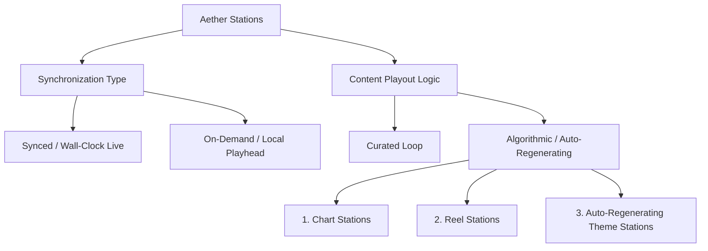

# Aether Stations: Station Taxonomy & UI Surface Specifications

This document outlines the classification of Aether Stations and details the component-level designs for both the Creator and Listener surfaces.

---

## 1. Station Taxonomy Tree

Aether classifies stations based on their playout synchronization properties and content update cycles.



### Playout & Synchronization Classifications

#### A. Synced (Wall-Clock Live)
*   **Behavior:** Every listener is locked to the same millisecond of the audio track. Pausing does not halt the stream; instead, resuming fast-forwards the playhead to the current wall-clock offset.
*   **Ideal for:** Radio-style experiences, live commentary, listening parties, and synchronized drops.

#### B. On-Demand (Local Playhead)
*   **Behavior:** The playlist is personal. Playback starts at the beginning of the track when a listener joins. Pausing halts the playhead locally.
*   **Ideal for:** Podcast playlists, album walks, and personalized daily digests.

### Playout Logic Classifications

#### 1. Chart Stations
*   **Playout Update Engine:** Dynamically generates queues based on real-time value-streaming analytics.
*   **Formula:** Tracks are ranked and queued based on a weighted Boost Rate Index ($BRI$):
    \[BRI = \frac{\text{Total Sats Streamed} + (\text{Boost Count} \times 500)}{\text{Interval Hours} + 1}\]
*   **Rotation:** Updated every 60 minutes.

#### 2. Reel Stations
*   **Playout Update Engine:** Designed for micro-audio highlights and audio snippets (max 90 seconds).
*   **Behavior:** Loop-based short forms. Users can swipe/skip to change tracks. Each skip logs a telemetry event to Asphaleia to penalize under-performing tracks in the catalog rotation.

#### 3. Auto-Regenerating Stations
*   **Playout Update Engine:** Feeds that scan target podcast directories (e.g., via Indexers or Keryx Poller) and ingest new episodes matching tag rules (e.g. `genre: synthwave`).
*   **Behavior:** Automatically generates crossfades and track order without human curation.

---

## 2. Creator Surface Component Blueprint

The Creator Surface provides tools to initialize, configure, and monitor broadcast channels.

```
+-----------------------------------------------------------------------+
|  Creator Dashboard                                     [ Akroasis UI ]|
+-----------------------------------------------------------------------+
|  +---------------------------+  +----------------------------------+  |
|  | Station Configurator      |  | Real-Time Playout Editor         |  |
|  |                           |  |                                  |  |
|  | Title: [ Synthwave Cafe ] |  | Active Track: [ Track 03 (01:23)]|  |
|  | Epoch: [ 1780283020000  ] |  | Queue:                           |  |
|  | Mode:  (x) Synced ( ) OD  |  | 1. [ Track 04 ] (03:45) [Move Up]|  |
|  |                           |  | 2. [ Track 05 ] (04:12) [Remove]  |  |
|  | [ Save Configuration ]    |  | [ Add Track to Queue ]           |  |
|  +---------------------------+  +----------------------------------+  |
|  +---------------------------+  +----------------------------------+  |
|  | Value Split Matrix        |  | Asphaleia Analytics Node         |  |
|  |                           |  | Active Listeners: [ 1,420 ]      |  |
|  | Curator: [ 5%  ] (Self)   |  | Avg. RTT:         [ 42ms  ]      |  |
|  | Producer:[ 10% ] [Edit]   |  | Sats / Minute:    [ 120   ]      |  |
|  | Artist:  [ 85% ] [Edit]   |  | Drift Warnings:   [ 0     ]      |  |
|  +---------------------------+  +----------------------------------+  |
+-----------------------------------------------------------------------+
```

### Core Components
1.  **`<StationConfigurator>`**
    *   **Description:** Setup page for editing Station Title, Description, and Epoch sync values.
    *   **Properties:** `stationId`, `syncMode` (synced | on-demand), `fallbackUrl`.
2.  **`<RealtimePlayoutEditor>`**
    *   **Description:** Interactive queue builder for manually overriding the scheduled playlist or scheduling automatic updates.
    *   **Interactions:** Drag-and-drop reordering, crossfade duration slider.
3.  **`<ValueSplitMatrix>`**
    *   **Description:** Interface for setting recipient addresses and percentage splits. Calculates dynamic curation cuts in real-time.
4.  **`<AsphaleiaAnalyticsNode>`**
    *   **Description:** High-performance telemetry panel showing live listener count, average RTT, playhead drift charts, and cumulative value streaming logs.

---

## 3. Listener Surface Component Blueprint

The Listener Surface provides a highly interactive and synchronized audio playout client.

```
+-----------------------------------------------------------------------+
|  Station Player                                          [ Agora Room]|
+-----------------------------------------------------------------------+
|  +-----------------------------------------------------------------+  |
|  |  Playing Live on [ Synthwave Cafe ]                             |  |
|  |  Track: "Nightdrive" - by Waveshaper (02:14 / 04:30)            |  |
|  |  [||| Progress Bar - Synchronized to Horai Epoch ||||||||||| ]  |  |
|  +-----------------------------------------------------------------+  |
|  +----------------------------------+  +---------------------------+  |
|  | Agora Listening Room             |  | Value Stream Controller   |  |
|  | Listeners:                       |  | Rate: [ 5 sats/min ] [+/-]|  |
|  | [Avatar 1] [Avatar 2] [Avatar 3] |  | Active Splits:            |  |
|  | [Avatar 4] [Avatar 5] ...        |  | - Artist:   4.25 sats/min |  |
|  |                                  |  | - Platform: 0.50 sats/min |  |
|  | Speaker: [ Host Node ]           |  | - Curator:  0.25 sats/min |  |
|  |                                  |  | [ BOOST (500 sats) ]      |  |
|  +----------------------------------+  +---------------------------+  |
|  +-----------------------------------------------------------------+  |
|  | Choros Chat Area                                                |  |
|  | [User 1]: This track slaps!                                     |  |
|  | [User 2]: Sync offset is perfect, 10ms.                         |  |
|  | [Send Chat Message ... ]                                        |  |
|  +-----------------------------------------------------------------+  |
+-----------------------------------------------------------------------+
```

### Core Components
1.  **`<UnifiedPlayerEngine>`**
    *   **Description:** Wrapping component that manages HTML5 Audio context and performs micro-adjustments to the playback rate based on calculated drift.
    *   **State:** `currentTime`, `playbackRate`, `targetOffset`, `syncStatus` (aligned | adjusting | out-of-sync).
2.  **`<AgoraListeningRoom>`**
    *   **Description:** Presence visualizer displaying active profiles. Integrates with the Agora voice/chat system to manage hand-raising and host voice overlays.
3.  **`<ValueStreamController>`**
    *   **Description:** Manages LN payment loops. Includes UI buttons to boost (one-time payment with text message) or adjust the streaming rate per minute.
4.  **`<ChorosChatArea>`**
    *   **Description:** Text chat interface integrated directly with the Discord/Nostr pubsub gateway, ensuring text messages stay synchronized with the audio feed timestamp.
