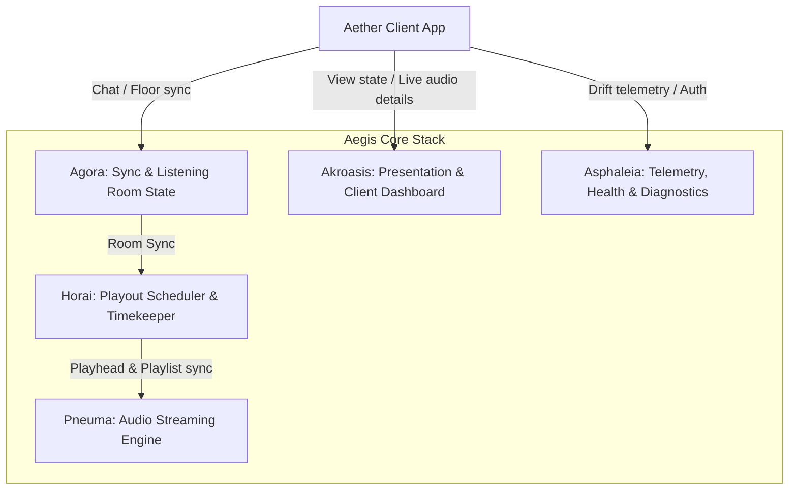

# Aether Stations: Architectural Specification

This document details the architectural specifications for **Aether Stations**, the synchronized and on-demand audio broadcast network layer built on top of the Aegis ecosystem.

---

## 1. Mapping to Aegis Locked Names

Aether is integrated directly into the Aegis subsystem architecture. The core operations and services map to the locked Aegis namespaces as follows:



*   **Agora (Listening Room & Sync State):** Manages the shared state of listening rooms, presence vectors, and floor control (speaking slots).
*   **Horai (Playout Scheduler & Timekeeper):** Coordinates playout schedules, calculates absolute track time offsets, and maintains cache sync across distributed nodes.
*   **Pneuma (Audio Streaming Pipeline):** Handles high-performance audio ingestion, encoding, track transitions, and metadata injection.
*   **Asphaleia (Telemetry & Security):** Collects client drift reports, logs network health, monitors server node diagnostics, and safeguards api keys.
*   **Akroasis (Presentation & Analytics):** Serves the dashboard interfaces, visualizes value split configurations, and renders live playback telemetry to users.

---

## 2. External Wall-Clock Sync Calculation Layer

To achieve seamless, lock-step playback across thousands of geo-distributed listeners without heavy streaming server infrastructure, Aether utilizes a client-side **Wall-Clock Sync Calculation Layer** coordinated by **Horai**.

### The Synchronization Math

Every synchronized station is anchored by a reference epoch time ($T_{\text{epoch}}$) and a looping sequence of audio segments, each with a duration $d_i$ in milliseconds.

Let the total station loop duration be $D_{\text{total}}$:

\[D_{\text{total}} = \sum_{i=1}^{n} d_i\]

For any current local client time $T_{\text{current}}$ (synchronized to UTC via NTP), the total elapsed time $T_{\text{elapsed}}$ since the station's initialization epoch is calculated as:

\[T_{\text{elapsed}} = (T_{\text{current}} - T_{\text{epoch}}) \pmod{D_{\text{total}}}\]

To determine which segment $k$ is currently playing and at what offset $O_k$ within that segment, the client iterates through the segment durations:

Let $S_m = \sum_{i=1}^{m} d_i$ be the cumulative duration up to segment $m$ (with $S_0 = 0$).

The client finds the unique index $k$ such that:

\[S_{k-1} \le T_{\text{elapsed}} < S_k\]

The target playhead offset $O_k$ within segment $k$ is then:

\[O_k = T_{\text{elapsed}} - S_{k-1}\]

### Drift Correction & Latency Compensation

Clients calculate network Round-Trip Time (RTT) using NTP-like exchanges with the Horai time coordinator:

\[\text{Drift Offset} = \left(\frac{(T_4 - T_1) - (T_3 - T_2)}{2}\right)\]

Where:
*   $T_1$: Timestamp of request departure from client.
*   $T_2$: Timestamp of request arrival at Horai server.
*   $T_3$: Timestamp of response departure from Horai server.
*   $T_4$: Timestamp of response arrival at client.

> [!TIP]
> If a client's calculated playhead drift exceeds $\pm 150\text{ ms}$, the player performs a micro-adjustment of the playback rate (scaling speed between $0.98\times$ and $1.02\times$) to smoothly realign the playhead without introducing audible audio glitches.

---

## 3. Value-Streaming Model

Aether Stations implement a micro-payment architecture leveraging Podcast 2.0 value tag specifications, allowing programmatic, real-time value routing during live playback.

### Split Configuration

Aether feeds dictate recipient splits directly inside the `<podcast:value>` tag blocks. When a station is active, the value-streaming client sends Satoshis (sats) per minute to the specified recipients.

```
   [ Listener Node ]
          │
          ├── (85% Standard Split) ────────> [ Track Creator / Host ]
          │
          ├── (10% Platform Cut) ──────────> [ Aegis Node Operator ]
          │
          └── (5% Dynamic Injection) ──────> [ Station Curator / App ]
```

### Curation-Cut Injection

To incentivize high-quality station programming, Aether clients support **curation-cut injection**. The player client inspects the station-level feed and the track-level feed:
1.  The track-level feed defines the baseline splits (e.g., 90% artist, 10% producer).
2.  The station curator inserts their split configuration (e.g., 5% curator fee).
3.  The client normalizes the remaining splits dynamically:
    \[S_{\text{new}} = S_{\text{original}} \times (1 - C_{\text{curator}})\]
    where $C_{\text{curator}}$ is the curator's fee percentage.

### Pre-Seed Grants

To jumpstart stations and ensure immediate payability, new stations are assigned a **Pre-seed Grant** allocation. 
*   **Grant pool:** Administered via a multi-signature hub wallet.
*   **Allocation:** Each validated station is granted up to $10,000\text{ sats}$ pre-loaded into their creator distribution pool to subsidize early stream hours.

> [!WARNING]
> **Support Caveats:** 
> *   Clients that do not support lightning payments (e.g., legacy RSS aggregators) will fallback to non-paying modes.
> *   If a value recipient node fails to resolve a valid Lightning Network invoice/destination address, the client redirects that recipient's split to a platform-level fallback escrow address, logging a warning to Asphaleia.

---

## 4. Interoperability Strategy & Standards Proposal Path

Aether aims to standardize live synchronized playlists for the broader podcasting community.

### Existing Standards Leverage
Aether utilizes standard **Podcast 2.0 Namespace (PC2.0)** tags, specifically:
*   `<podcast:liveItem>`: For marking scheduled and active live broadcasts.
*   `<podcast:value>`: For routing streaming payments.

### Proposed Standards Path
Aegis proposes the **PC2.0 musicL (Music Loop / Live Station)** extensions. The proposal path targets:
1.  **Draft Stage:** Publication of the schema on GitHub and community forums.
2.  **Implementation Stage:** Deploying native support in the `aegis-pod-bot` and Akroasis client reference designs.
3.  **RFC Stage:** Formal proposal to the Podcast Standards Project to incorporate `syncEpoch` and `loopDuration` attributes directly into the core namespace specifications.
