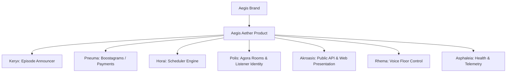

# Aegis Aether — Architecture & Naming Catalog

This document defines the canonical Greek-based naming schema for the Aegis Aether ecosystem modules, mapping human-friendly project branding to technical components.

---

## 1. Naming & Component Catalog

### 🏛️ AEGIS (EE-jis) — The Parent Brand
* **Greek Origin:** *Aigis* — the protective shield of Zeus or Athena; by extension: backing, sponsorship, and safety.
* **System Role:** The parent brand for our podcasting + Value-for-Value (V4V) suite.

### 🌬️ AEGIS AETHER (EE-jis AY-ther) — The Product
* **Greek Origin:** *Aither* — the pure upper air breathed by the gods; the medium through which light and sound travel.
* **System Role:** The live, scheduled V4V radio and synchronized listening platform (composed of the Discord bot, live sync, and stream players).

### 👥 POLIS (POH-lis) — Shared Presence & Identity
* **Greek Origin:** *Polis* — the city-state, representing public community assembly and citizenship.
* **System Role:** The listener presence system, wallet mapping, and identities within the listening rooms (e.g. `AgoraListener`, user directory connection in `src/modules/agora-room.ts`).

### ⏳ HORAI (HOH-rye) — Scheduler Engine
* **Greek Origin:** *Horai* — the goddesses of the seasons and natural order; the keepers of time.
* **System Role:** The scheduled queue coordinator and track transition engine (`src/modules/horai-scheduler.ts`).

### 👁️ AKROASIS (Ah-kroh-AH-sis) — Presentation Layer
* **Greek Origin:** *Akroasis* — the act of listening, hearing, or a lecture/presentation.
* **System Role:** The embedded web dashboard, public server API endpoints, and public web player view (`src/dashboard/server.ts`, `src/dashboard/public/`).

### 📣 KERYX (KEH-rix) — RSS Announcer
* **Greek Origin:** *Keryx* — the herald or messenger of the gods (e.g., Hermes' staff bearers).
* **System Role:** The RSS feed poller and new episode Discord announcement module (`src/pollers/episode-poller.ts`, `src/modules/feed-scanner.ts`).

### 🎙️ RHEMA (RHEE-mah) — Floor Controller
* **Greek Origin:** *Rhema* — that which is spoken; a word or utterance.
* **System Role:** Host microphone queue management, active floor assignment, and voice mute/unmute gating (`src/modules/rhema-floor.ts`).

### ⚡ PNEUMA (NEW-mah) — Satoshis Stream & Boosts
* **Greek Origin:** *Pneuma* — the vital breath, spirit, or creative energy.
* **System Role:** The satoshis payment streams, live boostagram alerts, and wallet split logic (`src/pollers/boost-poller.ts`, `src/db/database.ts` boost caches).

### 🛡️ ASPHALEIA (Ahs-fah-LAY-ah) — Observability & Telemetry
* **Greek Origin:** *Asphaleia* — security, safety, and prevention of slips (literally "not falling").
* **System Role:** Telemetry logging, error taxonomy mapping, and the `/health` diagnostic endpoints (`src/modules/telemetry.ts`).

---

## 2. Structural Schema

